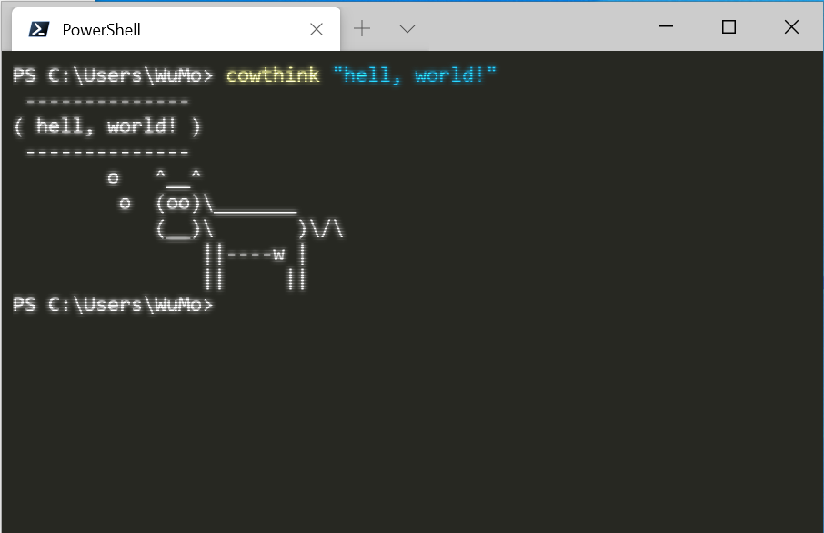

#配置
```json
{
    "$schema": "https://aka.ms/terminal-profiles-schema",
    "defaultProfile": "{574e775e-4f2a-5b96-ac1e-a2962a402336}",
    "initialCols": 80,
    "copyOnSelect": true,
    "confirmCloseAllTabs": false,
    "profiles": {
        "defaults": {
            // Put settings here that you want to apply to all profiles
            "useAcrylic": true,
            "acrylicOpacity": 0.95,
            "antialiasingMode": "cleartype",
            "colorScheme": "ubuntu",
            "fontFace": "JetBrains Mono",
            "cursorShape": "filledBox",
            "experimental.retroTerminalEffect": true
        },
        "list": [
           ...
        ]
    },
    // Add custom color schemes to this array
    "schemes": [
        {
            "name": "ubuntu",
            "background": "#272822",
            "foreground": "#CACACA",
            "black": "#272822",
            "red": "#A70334",
            "green": "#74AA04",
            "yellow": "#B6B649",
            "blue": "#01549E",
            "purple": "#89569C",
            "cyan": "#1A83A6",
            "white": "#CACACA",
            "brightBlack": "#7C7C7C",
            "brightRed": "#F3044B",
            "brightGreen": "#8DD006",
            "brightYellow": "#CCCC81",
            "brightBlue": "#0383F5",
            "brightPurple": "#a87db8",
            "brightCyan": "#58C2E5",
            "brightWhite": "#FFFFFF"
        }
    ],
    // Add any keybinding overrides to this array.
    // To unbind a default keybinding, set the command to "unbound"
    "keybindings": [ ]
}
```
<!-- more -->

#最终效果展示


#添加WindowsTerminal到右键菜单
创建`install.cmd`文件，内容如下：
```cmd
set menu_name=Windows Terminal
set exe_path=C:\...\WindowsTerminalexe

reg add "HKCU\Software\Classes\Directory\shell\%menu_name%" /v "Icon" /d "\"%exe_path%\"" /f
reg add "HKCU\Software\Classes\Directory\shell\%menu_name%\command" /d "\"%exe_path%\" -d ." /f

reg add "HKCU\Software\Classes\Directory\Background\shell\%menu_name%" /v "Icon" /d "\"%exe_path%\"" /f
reg add "HKCU\Software\Classes\Directory\Background\shell\%menu_name%\command" /d "\"%exe_path%\" -d ." /f

reg add "HKCU\Software\Classes\LibraryFolder\Background\shell\%menu_name%" /v "Icon" /d "\"%exe_path%\"" /f
reg add "HKCU\Software\Classes\LibraryFolder\Background\shell\%menu_name%\command" /d "\"%exe_path%\" -d ." /f
```
对应的`uninstall.cmd`文件，内容如下：
```cmd
set menu_name=Windows Terminal

reg delete "HKCU\Software\Classes\Directory\shell\%menu_name%" /f
reg delete "HKCU\Software\Classes\Directory\Background\shell\%menu_name%" /f
reg delete "HKCU\Software\Classes\LibraryFolder\Background\shell\%menu_name%" /f
```
以管理员身份运行`install.cmd`就可以将Windows Terminal添加至右键菜单。如果不需要了，也可以通过`uninstall.cmd`来删除菜单选项。